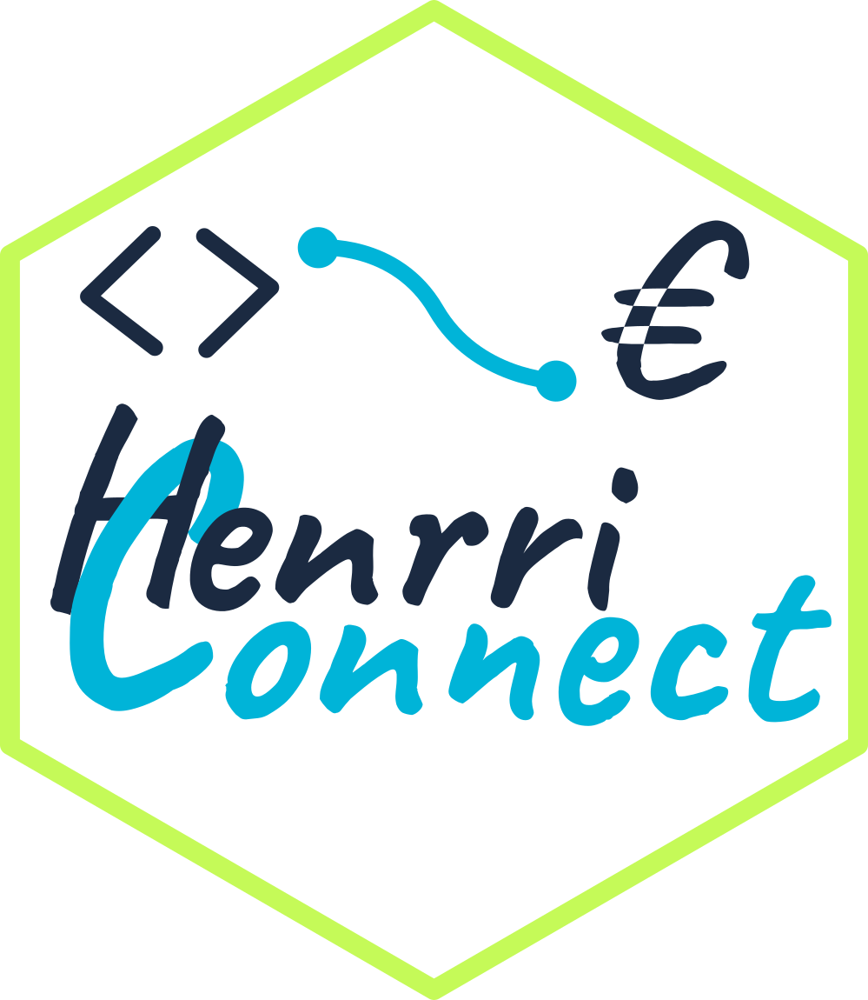

# henrri-connect

[](https://pypi.org/project/henrri-connect/)
[](https://pypi.org/project/henrri-connect/)
[](LICENSE)
[](https://remiv1.github.io/henrri-connect/)



Bibliothèque Python souveraine pour l'[API de facturation Henrri](https://api-sandbox.henrri.io/scalar).
Fournit un client **synchrone** et **asynchrone** pour interagir avec l'ensemble des ressources de l'API : clients, factures, articles, unités, revenus, etc.

> Ce SDK est un client Python non officiel pour l’API Henrri. Il n’est ni affilié, ni soutenu, ni approuvé par Henrri. Henrri est une marque déposée appartenant à son éditeur.

---

## Sommaire

- [henrri-connect](#henrri-connect)
  - [Sommaire](#sommaire)
  - [Installation](#installation)
  - [Démarrage rapide](#démarrage-rapide)
    - [Authentification](#authentification)
    - [Mode synchrone](#mode-synchrone)
    - [Mode asynchrone](#mode-asynchrone)
  - [Modules disponibles](#modules-disponibles)
  - [Gestion des erreurs](#gestion-des-erreurs)
  - [Développement](#développement)
  - [Contribution](#contribution)
  - [Licence](#licence)

---

## Installation

```bash
pip install henrri-connect
```

Dépendances : [`httpx`](https://www.python-httpx.org/) et [`pydantic`](https://docs.pydantic.dev/) v2.

---

## Démarrage rapide

### Authentification

Le client se connecte automatiquement à la première requête et gère le renouvellement du token. Il n'est pas nécessaire d'appeler `authenticate()` explicitement.

```python
from henrri_connect import HenrriClient

client = HenrriClient("votre_client_id", "votre_client_secret")
```

L'URL par défaut est l'environnement **sandbox** (`https://api-sandbox.henrri.io`). Pour pointer vers la production, passez `base_url` :

```python
client = HenrriClient(
    "votre_client_id",
    "votre_client_secret",
    base_url="https://api.henrri.io",
)
```

### Mode synchrone

```python
from henrri_connect import HenrriClient

client = HenrriClient("client_id", "client_secret")

# Vérifier la connexion
print(client.secures.hello_world())

# Lister les clients (page 1, 20 résultats)
result = client.customers.list_customers(page=1, limit=20)
for customer in result.data:
    print(customer.name)

# Créer un document
from henrri_connect.models import Document
doc = client.documents.add(Document(customer_id=42, document_type_id=1))
print(doc.id)
```

### Mode asynchrone

```python
import asyncio
from henrri_connect import HenrriClient

async def main():
    client = HenrriClient("client_id", "client_secret", async_mode=True)

    # Lister les articles
    result = await client.items.list_items(limit=10)
    for item in result.data:
        print(item.name)

asyncio.run(main())
```

---

## Modules disponibles

Le client expose un sous-client par ressource API. Chaque sous-client est identique en synchrone et asynchrone (les méthodes async renvoient des coroutines).

| Attribut | Description | Documentation |
| --- | --- | --- |
| `client.secures` | Endpoint de santé de l'API | [docs/secures.md](docs/secures.md) |
| `client.users` | Utilisateurs et entreprises associées | [docs/users.md](docs/users.md) |
| `client.companies` | Entreprises | [docs/companies.md](docs/companies.md) |
| `client.customers` | Clients (CRUD + contacts) | [docs/customers.md](docs/customers.md) |
| `client.documents` | Documents (factures, devis, BL…) | [docs/documents.md](docs/documents.md) |
| `client.document_lines` | Lignes de document | [docs/document_lines.md](docs/document_lines.md) |
| `client.document_types` | Types de document (référentiel) | [docs/document_types.md](docs/document_types.md) |
| `client.document_line_types` | Types de ligne de document (référentiel) | [docs/document_line_types.md](docs/document_line_types.md) |
| `client.items` | Articles / produits | [docs/items.md](docs/items.md) |
| `client.item_categories` | Catégories d'articles | [docs/item_categories.md](docs/item_categories.md) |
| `client.units` | Unités de mesure | [docs/units.md](docs/units.md) |
| `client.revenues` | Statistiques de revenus | [docs/revenues.md](docs/revenues.md) |

Référence API complète : [remiv1.github.io/henrri-connect](https://remiv1.github.io/henrri-connect/)

---

## Gestion des erreurs

Toutes les erreurs HTTP sont converties en exceptions typées héritant de `HenrriError` :

| Exception | Code HTTP |
| --- | --- |
| `HenrriAuthError` | 401 — Non authentifié |
| `HenrriForbiddenError` | 403 — Accès interdit |
| `HenrriNotFoundError` | 404 — Ressource introuvable |
| `HenrriValidationError` | 400 / 422 — Données invalides |
| `HenrriServerError` | 5xx — Erreur serveur |

```python
from henrri_connect import HenrriClient
from henrri_connect.exc import HenrriNotFoundError, HenrriAuthError

client = HenrriClient("client_id", "client_secret")

try:
    customer = client.customers.get(9999)
except HenrriNotFoundError:
    print("Client introuvable.")
except HenrriAuthError:
    print("Identifiants invalides.")
```

---

## Développement

```bash
# Cloner le dépôt
git clone https://github.com/remiv1/henrri-connect.git
cd henrri-connect

# Créer un environnement virtuel et installer les dépendances dev
python -m venv venv
source venv/bin/activate
pip install -e ".[dev]"

# Lancer les tests
make test

# Générer la documentation
make docs

# Prévisualiser la documentation
make docs-serve
```

Commandes disponibles :

``` bash
make test          # Lancer les 96 tests
make build         # Construire la distribution (wheel + sdist)
make build-verify  # Vérifier les artefacts avec twine
make publish       # Publier sur PyPI (demande confirmation)
make docs          # Générer la doc HTML dans docs/
make docs-serve    # Servir la doc localement (port 8080)
make docs-clean    # Nettoyer les fichiers générés
make all           # test + build + build-verify + publish + clean
```

---

## Contribution

Les contributions sont les bienvenues ! Consultez [CONTRIBUTING.md](CONTRIBUTING.md) pour les conventions de code, le workflow de PR et les bonnes pratiques.

---

## Licence

Distribué sous licence MIT. Voir [LICENSE](LICENSE).
